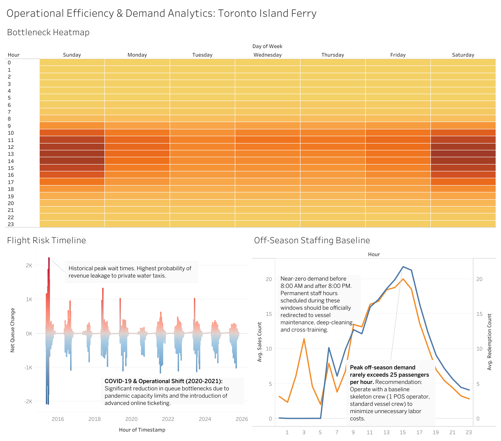

# Toronto Island Ferry: Operations & Demand Analytics

[](https://www.python.org/)
[](https://pandas.pydata.org/)
[](https://www.sqlite.org/)
[](https://public.tableau.com/)

**[👉 Click Here to View the Interactive Tableau Dashboard](https://public.tableau.com/app/profile/yutong.lin7507/viz/OperationalEfficiencyDemandAnalyticsTorontoIslandFerry/OperationalEfficiencyDemandAnalyticsTorontoIslandFerry)**

---

## Dashboard Preview
*(A snapshot of the final interactive Tableau dashboard. Click the link above to interact with the live data).*



---

## Project Overview
Toronto's Jack Layton Ferry Terminal handles millions of passengers every year. During busy summer weekends, the lines get too long because passenger demand is much higher than the ferry capacity. When this happens, frustrated customers leave to use private water taxis, which means lost revenue for the city. On the other hand, the terminal is mostly empty during the winter, which can lead to overstaffing and wasted labor costs.

I built this data pipeline and dashboard to help operations managers schedule staff better, find exact bottleneck times, and save money.

## Data Source
The raw data for this project was sourced directly from the City of Toronto's Open Data Portal:
* **Dataset:** [Toronto Island Ferry Ticket Counts](https://open.toronto.ca/dataset/toronto-island-ferry-ticket-counts/)

## How I Built This (Tech Stack)
This project is a complete data pipeline, from raw data to final dashboard:
* **Python & Pandas (Data Engineering):** I cleaned raw 15-minute timestamp data covering 11 years (2015-2026). I also created new features to help the analysis, like checking if a day is a weekend or off-season, and calculating the net queue change.
* **SQLite (Business Logic):** I built a local database to run queries and calculate the historical financial impact of people leaving the line for water taxis.
* **Tableau (Data Visualization):** I designed an interactive dashboard so managers can easily see capacity planning and staffing baselines.

## Key Findings & Visualizations
Based on 11 years of data, I built three main views in the dashboard to help make business decisions:

### 1. Bottleneck Heatmap (When to Add Staff)
* **What I found:** 70% of the worst bottleneck events happen between Friday afternoon and Sunday evening.
* **What to do:** Managers need to schedule extra staff specifically during these hours. Having shift overlaps start 15 minutes before peak times will help keep the lines moving.

### 2. Flight Risk Timeline (When We Lose Customers)
* **What I found:** Between 10:00 AM and 2:00 PM on summer weekends, the lines grow much faster than people can board. This is the main "flight risk" window where people give up and pay for water taxis. 
* **What to do:** The data shows that introducing online ticketing in 2020/2021 really helped reduce these massive lines, proving digital ticketing works.

### 3. Winter Staffing Baseline (How to Save Labor Costs)
* **What I found:** From November to April, passenger traffic drops by over 80%. Even during the busiest winter hour, there are usually less than 25 passengers.
* **What to do:** The terminal only needs a basic skeleton crew in the winter. Staff working before 8:00 AM or after 8:00 PM can be safely reassigned to vessel cleaning, maintenance, or cross-training.

## Project Structure
```text
├── images/                      # Dashboard screenshots for README
├── raw_data/                    # Original Toronto Open Data Excel files
├── python_scripts/
│   ├── 01_clean_ferry_data.py   # The Python script I wrote to clean the data
│   └── 02_sql_analysis.py       # The SQL script for business queries.
│   └── 03_create_mini_db.py     # Extracts a 1,000-row sample for local testing.
├── CSV_for_analysis/            # Cleaned datasets ready for Tableau/SQL
├── dashboard/                   # Contains the local Tableau workbook files.
├── database/                    # The massive local SQLite database (excluded via `.gitignore`)
├── sample_database/             # Contains the lightweight sample DB safe for review.
├── README.md
└── requirements.txt
